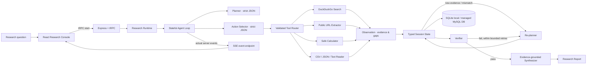
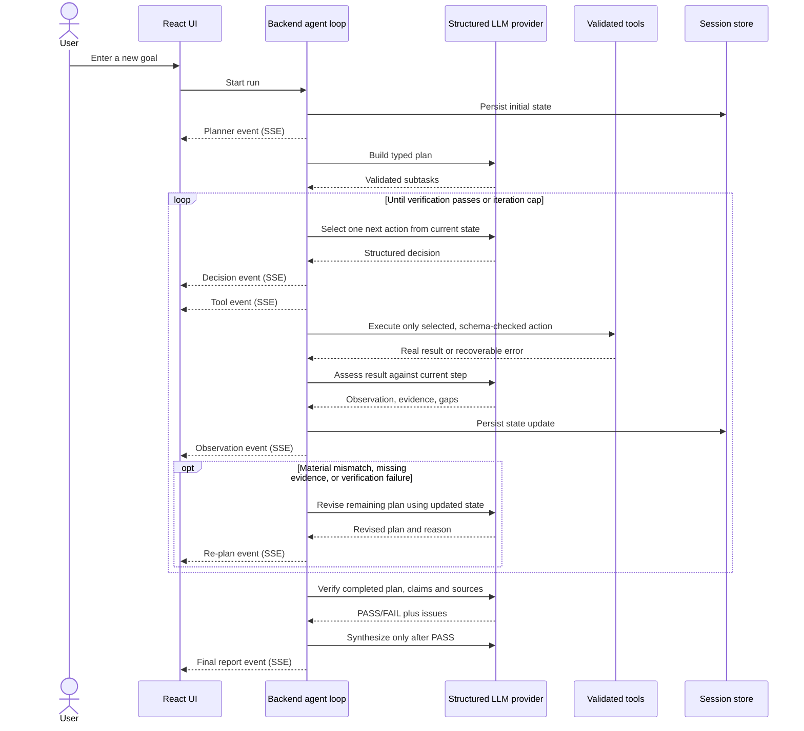

# ResearchPilot

> **From Question → Research → Evidence → Verification → Decision.**

ResearchPilot is a transparent research-and-decision agent. It accepts a new goal, builds an executable plan, selects tools from the current state, collects real source material, observes what is missing, re-plans when findings change the route, verifies before synthesis, and persists a replayable trace.

## Why this is not a simple LLM wrapper

A wrapper does one model call and displays its answer. ResearchPilot runs a **bounded stateful decision loop**. Structured model outputs are validated before the backend dispatches a tool; tool results become observations and evidence; those observations feed the next decision; a mismatch can change the plan; verification failures can send the state back through research; synthesis is gated on verification. The frontend subscribes to the backend's **actual event stream**, not a list of staged example messages.

The live acceptance test is to enter a **fresh research question** and watch these emitted stages:

**Planner → Tool → Observation → Decision → Re-plan (when justified) → Verification → Final Report**

Re-planning is conditional: the trace shows it when the running agent finds a scope mismatch, material gap, or verification failure. The system does not insert a pretend re-plan merely to make a demo look busy.

## Product overview

- Arbitrary research goals with optional constraints and a text-based CSV/JSON/TXT/Markdown attachment.
- Typed plan steps with objectives, information needs, preferred tools, and completion criteria.
- Live, server-side LLM planning, structured next-action selection, observation, re-planning, verification, and synthesis.
- Actual DuckDuckGo HTML web search, guarded public-page extraction, safe arithmetic, and bounded file reading.
- Source/evidence records, uncertainty labels, verified report, source panel, and Markdown export.
- Server-Sent Events (SSE) for trace events plus reconnect/replay from the persisted session.
- Durable session snapshots: SQLite locally; the managed database in the WebDev deployment.
- Bounded agent iterations, tool timeouts, validation, and safe error recovery.

## Architecture



## Workflow



## State model

`ResearchSession` includes:

- `id`, `goal`, status and UTC millisecond timestamps
- current `plan` and per-step completion state
- append-only numbered `events`
- unique `sources` and structured `evidence`
- actual `toolCalls`, `decisions`, errors and verifier output
- report plus metrics for duration, calls, searches, sources, replans, steps, errors, iterations and verification

The state stays in process memory during execution and is snapshotted into the session store at every emitted transition. The SSE endpoint replays missed events when a browser reconnects.

## Agent and prompt architecture

Original orchestration logic is written specifically for ResearchPilot in `server/research/engine.ts`. The LLM does not return executable code. It produces strict-schema JSON for:

1. Initial plan
2. One next action at a time
3. Evidence observation
4. Revised plan and reason
5. Independent final verification
6. Final grounded report

Prompts are separated in `app/prompts/index.ts`. The action dispatcher validates enumerated action types and tool-specific inputs. Each search decision dispatches one concise query; if public search returns no parseable results, the adapter makes one transparent simplified-query retry. Maximums are three replans, nine action turns, bounded search results, capped page/file text, and time-limited network requests.

### Tool providers

- **Web search:** live DuckDuckGo HTML search; results are parsed into source IDs, titles, domains, URLs, snippets and retrieval timestamps. It requires no key in the supplied app configuration. The provider is replaceable behind `webSearch()`.
- **URL extractor:** only public HTTP(S) URLs are accepted. Private/local IPs and internal hostnames are rejected; content size and fetch duration are capped.
- **Calculator:** a small deterministic parser with arithmetic precedence, parentheses, input/size limits and no `eval`/shell execution.
- **File reader:** bounded UTF-8 CSV, JSON, TXT and Markdown. Uploaded data is passed only to the agent run that requested it.

Search results are claims/leads, not endorsements. The verifier checks relevance and evidence support; the report labels calculations, assumptions and uncertainty.

## LLM provider abstraction

The default in the managed app is the server-side **Manus built-in LLM**. At runtime it fetches the model catalog and prefers `gpt-5-mini`; `LLM_MODEL` can override it. The interface in `server/research/llm.ts` also supports a configured OpenAI-compatible endpoint. Keys are never sent to the browser. The browser cannot access Manus MCP tools.

For the local Docker path, set `LLM_PROVIDER=openai_compatible`, `LLM_MODEL`, `LLM_BASE_URL`, and `LLM_API_KEY` for a provider that supports strict JSON-schema output. No live research is performed in a fake mode if the LLM is unavailable; the run reports an error instead.

## Persistence

Local development uses Node 22's built-in SQLite by default (`./data/researchpilot.sqlite`). WebDev sessions use the configured database via Drizzle. The managed schema migration for `research_sessions` is in `drizzle/0001_perpetual_grey_gargoyle.sql`. Each row contains searchable goal/status/timestamps and a versionable JSON snapshot of the actual execution.

## Run locally

Requires Node.js 22+ and pnpm 10+.

```bash
# Create the private .env values shown in docs/CONFIGURATION.md.
# For local hosting, choose a compatible structured-output LLM endpoint.
pnpm install
pnpm dev
```

Open <http://localhost:3000>. Enter any research question and watch the **Live agent trace**. Runs and history are saved in `data/researchpilot.sqlite`.

### Local variables

| Variable | Purpose |
| --- | --- |
| `LLM_PROVIDER` | `manus_builtin` (managed app) or `openai_compatible` |
| `LLM_MODEL` | Optional built-in override; required for compatible provider |
| `LLM_BASE_URL` | OpenAI-compatible base URL for local hosting |
| `LLM_API_KEY` | Server-only key for a compatible provider |
| `RESEARCH_STORAGE` | `sqlite` for local development or `mysql` for managed DB |
| `RESEARCH_DB_PATH` | Optional SQLite file path (default `./data/researchpilot.sqlite`) |
| `DATABASE_URL` | Managed database connection string when using MySQL mode |

The bundled web-search provider is keyless; no fabricated results are included. Public HTML search availability/shape may change, in which case a visible tool error is stored and prior evidence is retained.

## Example queries

1. **Workshop decision:** “Should our college run a two-day AI/ML workshop for 200 students? Find comparable events and costs, calculate the direct budget, and give an evidence-backed action plan.”
2. **Competitive research:** “Compare three AI coding platforms on current pricing, features and intended users. Prefer primary sources, identify conflicting pricing, then verify the table.”
3. **Data assistant:** Attach a CSV and ask: “Which category has the highest recorded score, what share does it represent, and what trend needs checking?”

The system can also extract public URLs discovered in a search, run safe calculations, and explain when a source does not answer the original question.

## Running tests

```bash
pnpm test
pnpm check
pnpm build
```

Vitest mocks the model/search boundaries for repeatable tests. Tests cover the actual orchestration state path, mismatch-driven re-planning, verification before synthesis, calculator boundaries, URL guards, file bounds, source normalization, SQLite persistence, and the scaffold authentication endpoint. No expensive external API is required by the test suite.

## Deployment

The full-stack WebDev project already includes a server, LLM integration, and managed database. Its server-only environment provides `BUILT_IN_FORGE_API_URL`, `BUILT_IN_FORGE_API_KEY`, and `DATABASE_URL`. Apply the reviewed additive `research_sessions` table migration before running history-backed sessions. For independent Node hosting, see `Dockerfile` and `docker-compose.yml`.

Deployment note: public run/session API procedures are used for frictionless contest demos. Before exposing sensitive/private research to the public internet, add user-level ownership checks and request-level rate limiting in the API routes.

## Demo script

See [`docs/DEMO_SCRIPT.md`](docs/DEMO_SCRIPT.md) for the timed 3–4 minute live demo. It explicitly asks the presenter to run a fresh goal and show real search result IDs, observations, decisions, re-planning when warranted, verification and final report.

## 5-slide presentation content

See [`docs/PRESENTATION.md`](docs/PRESENTATION.md) for exactly five technical slides.

## Design decisions and limitations

- **Transparency over magic:** each substantive stage is an event persisted by the backend; the interface consumes SSE and polls session snapshots as a reconnect fallback.
- **Custom, explainable orchestrator:** a simple typed loop is easier to defend than hiding behavior in a framework.
- **Bounded autonomy:** iteration/re-plan limits and strict tool schemas trade infinite exploration for predictable cost and latency.
- **Search is not ground truth:** HTML snippets can be incomplete or stale; source extraction and verifier checks help, but this is decision support—not an authoritative legal, medical or financial opinion.
- **Provider constraints:** the compatible provider must honor the strict JSON-schema chat-completion request. A model timeout/rate-limit can end the run with a recoverable error trace.
- **Local SQLite:** appropriate for a single-process prototype; use the managed database or a separate production store for multi-instance hosting.
- **File support:** PDF is deliberately not included in this lightweight prototype; uploaded text is limited to 80 KB.
- **Security follow-up:** add authentication/ownership and rate limits before treating run URLs as confidential in a public deployment.
- **SSE hosting:** the live preview and single-process runtime support SSE; choose a hosting plan/proxy that forwards streaming responses rather than buffering them.

## Originality statement

ResearchPilot's state types, event contract, action validation, conditional replanning, verifier gate, safe calculator, search normalization, and persistence strategy are an original implementation for this project. The project uses React, Express, tRPC, Drizzle, Vitest and the platform LLM only as infrastructure; it does not copy or rename an existing autonomous research-agent repository.

## License

MIT (see `LICENSE`).
